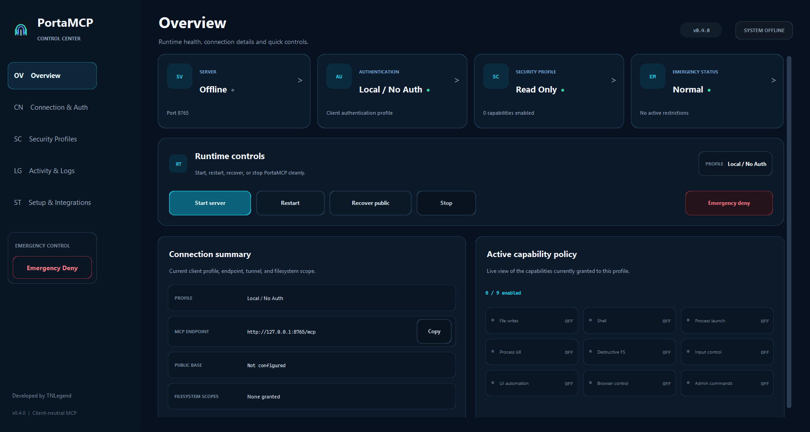
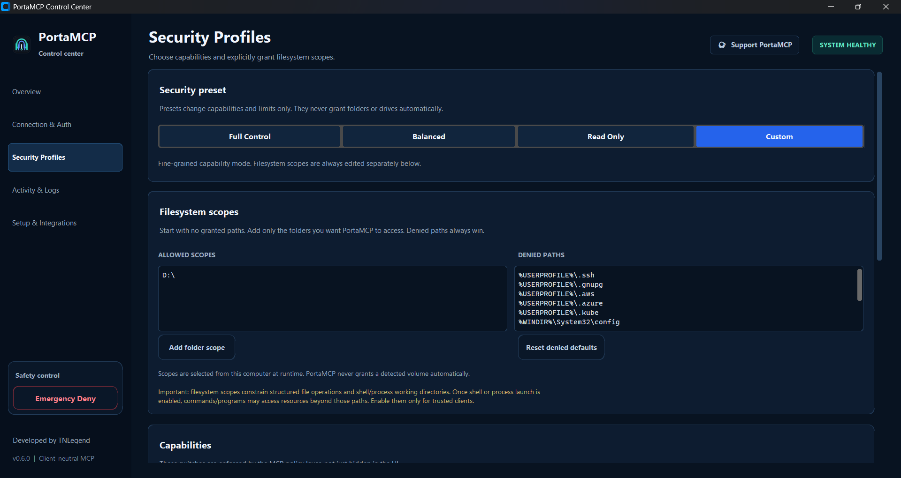
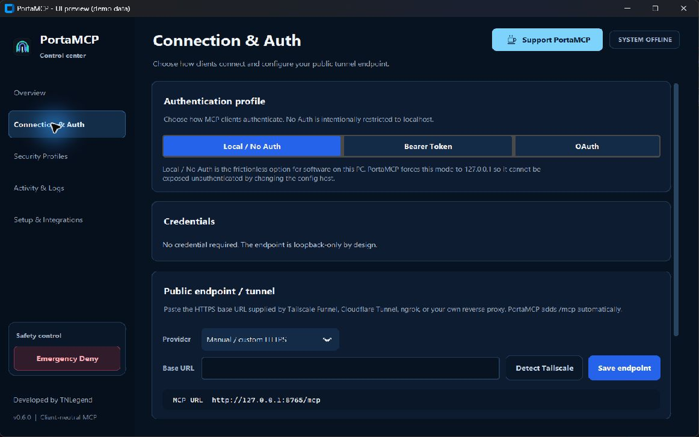

<p align="center">
  
</p>

<h1 align="center">PortaMCP</h1>

<p align="center">
  <strong>Client-neutral computer control over the Model Context Protocol for Windows and Linux.</strong><br>
  Configure, secure, launch, and monitor the server from one desktop Control Center.
</p>

<p align="center">
  
  
  
  
  
</p>

<p align="center">Developed by <strong>TNLegend</strong></p>

> [!WARNING]
> PortaMCP can expose powerful local capabilities, including file changes, shell commands, process control, desktop input, structured desktop UI automation, and browser control. A fresh installation grants <strong>no filesystem scope</strong> and starts with restrictive capabilities. Add only the scopes and capabilities you actually need. Never expose Local / No Auth mode to an untrusted network.

## What PortaMCP is

PortaMCP is a cross-platform MCP server plus a desktop Control Center. It gives compatible MCP clients a structured set of local computer-control tools without tying the server to one client, provider, or workflow. Windows and Ubuntu 24.04 are actively tested. Structured desktop automation uses Windows UI Automation on Windows and AT-SPI on supported Linux desktop sessions; platform-specific tool groups fail safely when unavailable.

The Control Center is the normal way to use the project. It handles first-run installation, authentication mode, filesystem scopes, security presets, runtime limits, public HTTPS endpoints, generated credentials, the emergency deny switch, server lifecycle, audit output, and the optional Chrome bridge.

<p align="center">
  
</p>

## Design goals

- **Client-neutral:** one MCP server for compatible clients rather than client-specific launchers or configuration forks.
- **UI-first:** routine setup and security configuration live in the PortaMCP Control Center.
- **Fail-closed filesystem access:** fresh configurations start with an empty filesystem scope list.
- **Explicit privilege:** security presets change capabilities only. They never add a folder or drive.
- **Deny rules win:** sensitive machine-derived paths remain blocked even when a broader parent scope is allowed.
- **Portable project state:** generated machine state, credentials, browser profiles, local configuration, caches, and builds are excluded from the public source tree.
- **Auditable control:** policy-protected actions can be recorded locally, and an emergency deny switch can stop tool execution immediately.

## Requirements

For the normal **release-bundle** path, PortaMCP bootstraps its own runtime on first launch. You do not need to prepare a virtual environment or install Python packages manually.

- Windows 10/11, or a modern Linux desktop
- Internet access during the first launch so PortaMCP can obtain its runtime dependencies and managed Chromium
- A compatible MCP client
- On Linux, a normal graphical desktop session with PolicyKit authorization available when system packages are missing

On Windows, the release bundle carries its own private portable CPython bootstrap archive, so an end user does not need Python installed at all. `PortaMCP.exe` verifies that bundled archive against its release checksum, extracts it only under PortaMCP's private runtime directory, and uses it to create the application virtual environment. It does not depend on `PATH`, the Python Launcher, or a machine-wide Python installation, and it does not register the bootstrap runtime system-wide or create Python file associations. On supported Linux package managers, the native launcher can request graphical administrator authorization to install Python/venv/Tk, PyGObject/AT-SPI, Git, and the small first-run GUI helper when they are missing.

### Platform status

| Platform | Current certification |
| --- | --- |
| **Windows 10/11** | Actively tested, including filesystem, shell/process, Git, screen/input, Windows UI Automation, managed browser, Chrome Live, Local/Bearer/OAuth, and security controls. |
| **Ubuntu 24.04 Desktop (X11)** | Actively tested for filesystem, shell/process, Git, screen capture, literal keyboard input, AT-SPI structured UI automation with an X11 top-level fallback for apps that do not expose AT-SPI, managed browser, Chrome Live, Local/Bearer/OAuth, public Tailscale Funnel use, and security controls. |
| **Other modern Linux distributions** | May work because the core uses Python/POSIX APIs, but they are not yet officially certified. Desktop behavior can vary across X11/Wayland and desktop environments. |
| **macOS** | Not yet officially certified. |

Do not interpret Linux support as a claim that every distribution, desktop environment, or Wayland compositor has been tested.

## Quick start

### 1. Get the repository

Clone the repository or use GitHub's **Download ZIP**, then extract it to a normal user-writable folder. The repository root is itself the runnable distribution: `PortaMCP.exe` and `PortaMCP` live beside the application sources and resolve all required files relative to that root. No `dist/` folder or separate release archive is required for normal use.

If Git is already installed, the direct clone path is:

**Windows (PowerShell):**

```powershell
git clone https://github.com/TNLegend/PortaMCP.git
cd PortaMCP
.\PortaMCP.exe
```

**Linux:**

```bash
git clone https://github.com/TNLegend/PortaMCP.git
cd PortaMCP
./PortaMCP
```

Git is needed only for the `git clone` acquisition step and for PortaMCP's optional Git tools. If Git is not installed yet, use GitHub's **Download ZIP** instead; PortaMCP does not require a system Git installation just to bootstrap and run on Windows. On Linux, the native launcher can install Git together with the other supported OS prerequisites after the project files are already present.

End users do not need to run a setup script or create a virtual environment themselves. Optional release archives may still be provided for convenience, but they are not required.

### 2. Launch PortaMCP

#### Windows

Double-click **`PortaMCP.exe`**. That is the only launcher an end user needs.

The Windows release already contains a portable CPython bootstrap archive. `PortaMCP.exe` verifies that archive, extracts it under `.portamcp/bootstrap-python`, creates `.venv`, installs all Python dependencies and managed Chromium, validates the finished environment, and opens the Control Center automatically. It does not rely on a preinstalled Python or the machine `PATH`, so no separate Python installer or system-wide Python setup is required.

> [!NOTE]
> `PortaMCP.exe` is currently unsigned, so Windows may show a reputation warning for a downloaded or locally built executable. The launcher source and rebuild script are included in `launcher/`.

#### Linux

From the repository root, run the native Linux launcher:

```bash
./PortaMCP
```

A normal Git clone preserves the Linux executable mode. If you obtained the tree through a ZIP/extractor that stripped Unix permissions and `./PortaMCP` reports `Permission denied`, repair the launcher bits once and retry:

```bash
chmod +x PortaMCP portamcp.sh launcher/build-launcher-linux.sh
./PortaMCP
```

The first launch is graphical. If required OS packages are missing, PortaMCP uses the system PolicyKit prompt to request one-time administrator authorization and installs the required Python/venv/Tk, PyGObject/AT-SPI, Git, and GUI-helper packages through a supported package manager. It then creates `.venv-linux`, installs all Python dependencies and managed Chromium, validates the environment, and opens the Control Center automatically.

Run PortaMCP as your normal desktop user, **not as root**. `portamcp.sh` remains as a compatibility/developer fallback and automatically delegates to the native `PortaMCP` launcher when that binary is present.

The currently certified Linux target remains **Ubuntu 24.04 Desktop/X11**. Other Linux distributions may use the same bootstrap logic when a supported package manager is detected, but they are not yet certified to the same level.

### What happens on the first launch

1. PortaMCP checks whether its private environment is already complete.
2. Missing platform prerequisites are prepared automatically where supported.
3. `.venv` on Windows or `.venv-linux` on Linux is created or repaired if a previous setup was interrupted.
4. pip and all PortaMCP Python dependencies are installed inside that private environment.
5. managed Chromium is installed, or a suitable system Chromium-family browser is used on Linux.
6. the completed environment is validated and the full Control Center opens automatically.

After that, launching the same GUI starts the Control Center directly. No separate setup script, activation command, `pip install`, or manual virtual-environment step is part of the normal end-user flow.

If the first launch is interrupted or the network is unavailable, PortaMCP leaves the partial private environment in place but does not mark setup as complete. Restore Internet access and launch the same GUI again; the bootstrap detects the incomplete environment and repairs/retries it automatically.

## Configure security first

A fresh configuration intentionally has **zero allowed filesystem scopes**.

Open **Security Profiles** before enabling broad control.

<p align="center">
  
</p>

### Filesystem scopes

The **ALLOWED SCOPES** box is empty on a fresh configuration. Use **Add folder scope** to grant only the locations that the connected client should be able to reach through structured filesystem operations and working-directory checks.

The **DENIED PATHS** box starts with portable sensitive-path templates. On Windows these are derived from environment variables at runtime and cover locations such as SSH/GPG material, cloud CLI credentials, Kubernetes configuration, Windows credential stores, and browser profile data.

**Denied paths always win over allowed scopes.**

Use **Reset denied defaults** to restore the built-in portable deny set after experimenting with custom entries.

> [!IMPORTANT]
> Filesystem scopes constrain the structured file tools and the working directory accepted by shell/process tools. A shell or launched program can access resources according to the operating-system permissions of the PortaMCP process itself. Enable Shell execution or Process launch only for clients you trust with that level of control.

### Security presets

Presets modify capability switches and runtime limits. They deliberately do **not** modify the filesystem scope list.

| Preset | Purpose | Capability behavior |
| --- | --- | --- |
| **Full Control** | Trusted automation that needs the broad tool surface | Enables file writes, shell, process start/kill, destructive file operations, input, UI automation, and browser control. Administrative shell patterns remain disabled by default. |
| **Balanced** | General automation with destructive operations reduced | Enables file writes, shell, input, UI automation, and browser control. Process start/kill, destructive file operations, and administrative command patterns stay disabled. |
| **Read Only** | Conservative inspection baseline | Disables file writes, shell, process control, desktop input, UI actions, and browser control. |
| **Custom** | Fine-grained policy | Keeps the current scopes and lets you choose each capability manually. |

Changing a preset never grants a drive, home directory, or project folder.

## Connection & Auth

Open **Connection & Auth** to choose how clients reach PortaMCP.

<p align="center">
  
</p>

PortaMCP provides three server profiles:

| Mode | Use it for | Security behavior |
| --- | --- | --- |
| **Local / No Auth** | A client running on the same computer | Forced to loopback only. It cannot bind No Auth mode to a non-loopback host. |
| **Bearer Token** | A trusted remote path or tunnel where a simple shared secret is appropriate | Requests to `/mcp` require the generated bearer token. Treat the token like a password. |
| **OAuth** | Remote MCP clients that support OAuth-style authorization | Requires a configured public `https://` base endpoint and uses PortaMCP's self-hosted authorization flow. |

The endpoint shown by the UI is derived from the selected profile and current configuration.

### Public HTTPS / tunnel endpoint

PortaMCP does not silently expose the machine to the Internet. Remote access is something you configure deliberately.

For OAuth, enter only the public HTTPS base URL, without `/mcp`, query parameters, or fragments. PortaMCP validates the URL and adds the public hostname to the transport's allowed-host set while retaining loopback hosts.

The Control Center can detect a Tailscale DNS name when the Tailscale CLI is available. You can also use a manually managed HTTPS tunnel or reverse proxy.

**Tailscale itself is an external prerequisite for the Tailscale Funnel path.** PortaMCP does not install Tailscale, create a Tailscale account, or sign the machine into a tailnet. Install Tailscale and sign in once using Tailscale's normal setup flow. The tailnet must also permit Funnel; if Tailscale requires one-time Funnel enablement, follow the prompt it provides. Once the Tailscale CLI is installed and connected, PortaMCP can detect the machine's Tailscale DNS URL and recover/reopen the Funnel for the configured PortaMCP port. On Linux, if `tailscaled` requires local operator permission, the Control Center can request the one-time `tailscale set --operator=<user>` change through PolicyKit.

Tailscale is **not** required for Local / No Auth mode, and OAuth can also use another HTTPS tunnel or reverse proxy that you manage. Tunnel provisioning, account access, tailnet policy, certificates outside Tailscale, and firewall policy remain under your control.

For remote use, prefer an authenticated profile and restrict who can reach the public endpoint.

## Start, stop, and emergency deny

The **Overview** page shows installation state, server state, selected auth mode, security preset, endpoint, filesystem scope count, and Chrome bridge status.

Use the primary server control to start or stop the selected profile. Configuration changes that affect the running server require a restart.

**Emergency Deny** is a local fail-closed switch. When active, the policy layer rejects protected tool actions even if the corresponding capability is otherwise enabled. Use **Resume** only after you intend to re-enable the server's tool surface.

## Optional PortaMCP Chrome Bridge

The managed Playwright browser tools and the current-Chrome tools are separate capabilities.

The optional **PortaMCP Chrome Bridge** extension lets PortaMCP work with tabs from the user's normal running Chrome profile. The server generates a local bridge configuration containing a short-lived local secret file that is excluded from version control.

Typical setup:

1. Start PortaMCP once so the local bridge configuration can be generated.
2. Open Chrome's extensions page.
3. Enable Developer mode.
4. Choose **Load unpacked** and select the `chrome_extension` folder.
5. Keep the extension enabled while using the `chrome_live_*` tools.

The extension is branded **PortaMCP Chrome Bridge**. Generated `chrome_extension/bridge_config.js` is local runtime state and is intentionally ignored by version control.

## Tool surface

PortaMCP exposes **75 MCP tools** across eleven groups.

| Group | Count | Purpose |
| --- | ---: | --- |
| System & safety | 3 | Runtime information, configured capabilities, emergency-stop status |
| Filesystem | 13 | List, inspect, read, write, patch, search, hash, copy, create, move, and delete within policy |
| Shell | 4 | One-shot shell execution and lightweight remembered shell sessions |
| Process | 3 | List, start, and terminate processes |
| Git | 5 | Status, diff, history, staging, and local commits |
| Screen | 4 | Monitor geometry and screen capture |
| Input | 8 | Mouse, scrolling, typing, key presses, and hotkeys |
| Windows UI | 6 | Window discovery, UI Automation inspection, focus, click, and text actions |
| Linux UI | 6 | AT-SPI window discovery, structured inspection, focus, semantic click, and text actions |
| Managed browser | 13 | Playwright/browser lifecycle, navigation, inspection, interaction, evaluation, and screenshots |
| Current Chrome bridge | 10 | Status, tabs, inspection, navigation, interaction, evaluation, screenshots, and detach |
| **Total** | **75** | |

<details>
<summary><strong>Show all 75 tool names</strong></summary>

**System & safety**

`system_info`, `server_capabilities`, `security_emergency_stop_status`

**Filesystem**

`fs_list`, `fs_stat`, `fs_read_text`, `fs_read_bytes`, `fs_write_text`, `fs_patch_text`, `fs_search`, `fs_hash`, `fs_copy`, `fs_exists`, `fs_mkdir`, `fs_move`, `fs_delete`

**Shell**

`shell_run`, `shell_session_create`, `shell_session_run`, `shell_session_close`

**Process**

`process_list`, `process_start`, `process_kill`

**Git**

`git_status`, `git_diff`, `git_log`, `git_add`, `git_commit`

**Screen**

`screen_monitors`, `screen_capture`, `screen_capture_region`, `screen_capture_to_file`

**Input**

`input_mouse_position`, `input_mouse_click`, `input_mouse_move`, `input_mouse_drag`, `input_scroll`, `input_type_text`, `input_press`, `input_hotkey`

**Windows UI Automation**

`windows_active`, `windows_list`, `windows_focus`, `windows_ui_tree`, `windows_click_control`, `windows_set_text`

**Linux AT-SPI UI Automation**

`linux_active`, `linux_list`, `linux_focus`, `linux_ui_tree`, `linux_click_control`, `linux_set_text`

AT-SPI remains the structured semantic backend. On X11, top-level windows that do not publish AT-SPI (for example some Tk/CustomTkinter applications) are still surfaced by `linux_list`/`linux_active` with an `x11:` window id and can be focused. `linux_ui_tree` returns top-level metadata plus a warning for those fallback windows; semantic control selection/text editing still requires AT-SPI.

**Managed browser**

`browser_start`, `browser_connect_cdp`, `browser_pages`, `browser_new_page`, `browser_navigate`, `browser_snapshot`, `browser_click`, `browser_fill`, `browser_press`, `browser_evaluate`, `browser_screenshot`, `browser_close_page`, `browser_stop`

**Current Chrome bridge**

`chrome_live_status`, `chrome_live_tabs`, `chrome_live_snapshot`, `chrome_live_activate`, `chrome_live_navigate`, `chrome_live_click`, `chrome_live_fill`, `chrome_live_evaluate`, `chrome_live_screenshot`, `chrome_live_detach`

</details>

Every protected tool checks the emergency-stop state first. Additional policy checks then apply according to the tool category and configured capability switches.

## Runtime and local files

Public source and local machine state are intentionally separated.

| Path | Purpose | Version-control policy |
| --- | --- | --- |
| `porta_mcp/` | PortaMCP Python package | Public source |
| `chrome_extension/` | Chrome bridge extension source | Public source, except generated bridge config |
| `launcher/` | Windows launcher source and build helper | Public source |
| `assets/` | Logo, icon, and documentation screenshots | Public source |
| `portamcp.pyw` | First-run/bootstrap entry point | Public source |
| `PortaMCP.exe` | Native Windows launcher at repository root | Public runnable artifact |
| `PortaMCP` | Native Linux launcher at repository root | Public runnable artifact |
| `.venv/`, `.venv-linux/` | Platform-local Python environments | Ignored |
| `.portamcp/` | Audit log, generated credentials, OAuth state, browser profile, UI state, emergency-stop file | Ignored |
| `config.json` | Machine-local active configuration | Ignored |
| `chrome_extension/bridge_config.js` | Generated local Chrome bridge connection data | Ignored |
| `build/`, `dist/` | Build outputs | Ignored |

A fresh clone therefore does not inherit the developer's filesystem scopes, tunnel hostname, credentials, browser profile, or other machine-local state.

## Configuration behavior

The Control Center creates `config.json` locally when needed. Source defaults live in `porta_mcp/config.py`.

Important defaults:

- host: loopback
- filesystem scopes: empty
- bearer token: not stored in the public config
- public HTTPS endpoint: empty
- all high-impact capability switches: off
- administrative command patterns: off
- audit logging: on
- denied paths: portable sensitive-path templates

Secrets generated by PortaMCP are written under `.portamcp/` and are not intended for source control.

## Developer entry points

After installation, the package exposes these console entry points:

```text
portamcp
portamcp-local
portamcp-http
portamcp-oauth
portamcp-ui
```

Most users should use the platform launcher (`PortaMCP.exe` on Windows or `./PortaMCP` on Linux) and the Control Center instead. `portamcp.sh` is the compatibility/developer fallback on Linux.

### Prepare Linux executable modes before a public Git commit

The canonical source tree may be maintained on Windows, but Git must record the Linux launchers as executable so a Linux user can clone and run `./PortaMCP` directly. After `git init` (or in an existing clone) and before the public commit/push, run:

```powershell
powershell -ExecutionPolicy Bypass -File .\launcher\prepare-git-modes.ps1
```

This does **not** initialize Git. It records/verifies mode `100755` for `PortaMCP`, `portamcp.sh`, and `launcher/build-launcher-linux.sh`. Use `-CheckOnly` to verify an existing index without changing it.

### Build an optional public ZIP from Windows

The repository itself remains the primary distribution. If you also want a portable ZIP built from the canonical Windows tree, use the included sanitizer/packager:

```powershell
.\.venv\Scripts\python.exe .\launcher\build-public-archive.py .\dist\PortaMCP-public.zip
```

The builder uses an explicit public allowlist, omits local config/state/caches/secrets, and stores Unix mode `100755` for the Linux launchers in ZIP metadata.

### Rebuild the Windows launcher

The launcher source is intentionally small and auditable. On a Windows machine with the required compiler available:

```powershell
powershell -ExecutionPolicy Bypass -File .\launcher\build-launcher.ps1
```

The resulting executable should remain beside `portamcp.pyw` and the project folders.

## Security notes

- Use the smallest filesystem scope possible.
- Keep the built-in denied paths unless you have a specific reason to change them.
- Treat Bearer and OAuth credentials as secrets.
- Keep Local / No Auth on loopback only.
- Do not enable shell, process launch, input control, UI automation, browser control, destructive filesystem operations, or administrative command patterns for untrusted clients.
- Review the local audit trail when diagnosing unexpected behavior.
- Use Emergency Deny immediately if you want protected tool activity to stop.
- A public tunnel is not a substitute for authentication and access control.

## Troubleshooting

### Windows first run reports that the private Python runtime is unavailable

Do **not** install Python system-wide for the normal Windows release flow. Make sure you extracted the complete PortaMCP release bundle and that `runtime/python-bootstrap.zip` and `runtime/python-bootstrap.sha256` are present next to the launcher tree. Launch `PortaMCP.exe` again; it verifies and repairs its private runtime automatically.

### Linux cannot create `.venv-linux`

Launch `./PortaMCP` again inside the normal graphical desktop session and accept the PolicyKit administrator prompt if it appears. On supported package managers the launcher installs the required Python/venv/Tk/AT-SPI/Git/Zenity prerequisites automatically. If automatic prerequisite installation is unavailable, install the matching venv package manually. On Ubuntu 24.04 with Python 3.12, the fallback command is:

```bash
sudo apt install -y python3.12-venv
```
Then run `./portamcp.sh` again as the normal desktop user.

### Installation is incomplete

Open PortaMCP again and let the bootstrap installer finish. The Control Center considers the environment installed only after its required Python packages are importable from `.venv` (Windows) or `.venv-linux` (Linux).

### OAuth will not start

OAuth requires a valid public HTTPS base URL. Enter only the base origin/host in **Connection & Auth**, then restart the server.

### Local / No Auth rejects a host

That is intentional. No-auth mode is loopback-only. Use Bearer Token or OAuth for an authenticated remote path.

### Chrome bridge is offline

Start PortaMCP, confirm the `chrome_extension` folder exists, reload the unpacked **PortaMCP Chrome Bridge** extension, and check the Overview status again.

### Linux desktop capture or physical input is unavailable

Run PortaMCP inside the normal logged-in graphical desktop session and keep that session unlocked while using screen, mouse, or keyboard-control tools. The current Ubuntu desktop certification uses X11. Wayland and other desktop/compositor combinations can impose additional capture or input restrictions.

### A file tool says a path is outside the configured scope

Add the required folder explicitly under **Security Profiles > Filesystem scopes**. Presets will not add it for you.

### A path is still blocked after adding a broader scope

Check **DENIED PATHS**. A deny rule takes precedence over an allowed scope.

## License

MIT. See [LICENSE](LICENSE).
